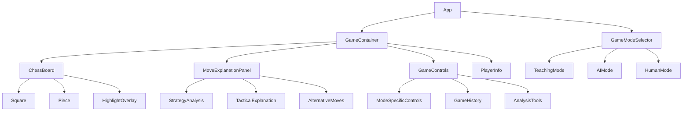
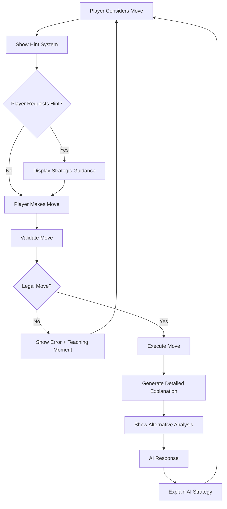
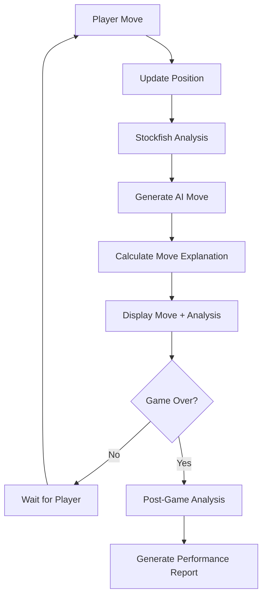
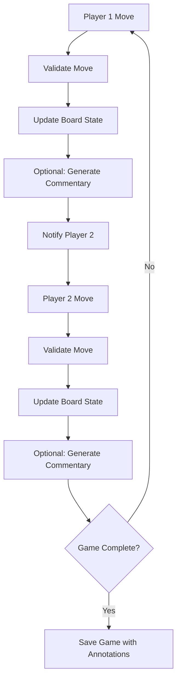

# Chess Auto-Play Game Design Document

## Overview

The Chess Auto-Play Game is an interactive educational chess platform that provides detailed move explanations and multiple game modes. Built with React, the application focuses on teaching chess strategies through comprehensive move analysis, offering various playing modes from tutorial-based learning to competitive gameplay.

### Core Value Proposition
- **Educational Focus**: Every move includes detailed strategic explanations
- **Adaptive Learning**: Multiple game modes catering to different skill levels
- **Strategic Understanding**: Deep analysis of tactics, positional play, and opening theory
- **Performance Tracking**: Monitor improvement over time with detailed analytics

## Technology Stack & Dependencies

### Frontend Framework
- **React 18+** with TypeScript for type safety
- **React Router** for navigation between game modes
- **React Context API** for global state management
- **React Hooks** for component lifecycle and state management

### Chess Engine & Logic
- **Chess.js** - Chess game logic and move validation
- **Stockfish.js** - AI engine for move calculation and analysis
- **PGN Parser** - For game notation and replay functionality

### UI Components & Styling
- **React-DnD** - Drag and drop for piece movement
- **Framer Motion** - Smooth animations for piece movements
- **Tailwind CSS** - Utility-first styling framework
- **Heroicons** - Icon library for UI elements

### Additional Libraries
- **Zustand** - Lightweight state management for game state
- **React-Hotkeys-Hook** - Keyboard shortcuts for advanced users
- **React-Tooltip** - Interactive tooltips for move explanations

## Component Architecture

### Component Hierarchy



### Core Components

#### ChessBoard Component
```typescript
interface ChessBoardProps {
  position: string; // FEN notation
  onMove: (move: Move) => void;
  highlightedSquares: Square[];
  allowedMoves: Move[];
  isFlipped: boolean;
}
```

**Responsibilities:**
- Render 8x8 chess board with pieces
- Handle drag-and-drop piece movement
- Display visual highlights for strategy explanation
- Show legal move indicators
- Animate piece movements

#### MoveExplanationPanel Component
```typescript
interface MoveExplanationProps {
  currentMove: Move;
  explanation: MoveExplanation;
  alternatives: AlternativeMove[];
  gameMode: GameMode;
}

interface MoveExplanation {
  strategy: string;
  purpose: string;
  strengths: string[];
  weaknesses: string[];
  tacticalElements: TacticalElement[];
}
```

**Responsibilities:**
- Display detailed move analysis
- Show strategic reasoning
- Present alternative move options
- Adapt explanation complexity based on game mode

#### GameModeController Component
```typescript
interface GameModeProps {
  mode: 'teaching' | 'ai' | 'human';
  difficulty?: DifficultyLevel;
  onModeChange: (mode: GameMode) => void;
}
```

**Responsibilities:**
- Switch between different game modes
- Configure mode-specific settings
- Manage AI difficulty levels
- Handle multiplayer session setup

## State Management Architecture

### Global State Structure
```typescript
interface GameState {
  // Board State
  position: string; // FEN notation
  gameHistory: Move[];
  currentMoveIndex: number;
  
  // Game Configuration
  gameMode: GameMode;
  difficulty: DifficultyLevel;
  playerColor: 'white' | 'black';
  
  // Move Analysis
  currentExplanation: MoveExplanation;
  suggestedMoves: Move[];
  analysisDepth: number;
  
  // UI State
  selectedSquare: Square | null;
  highlightedSquares: Square[];
  showHints: boolean;
  
  // Player Progress
  playerStats: PlayerStatistics;
  gameAnalysis: GameAnalysis[];
}
```

### State Management Pattern
- **Zustand Store** for game state management
- **React Context** for theme and user preferences
- **Local Storage** for game history and user progress
- **Session Storage** for temporary game data

## Game Mode Implementations

### Teaching Mode Architecture



**Teaching Mode Features:**
- **Progressive Hints**: Start with general strategy, become more specific
- **Mistake Analysis**: Explain why certain moves are suboptimal
- **Pattern Recognition**: Highlight common tactical patterns
- **Opening Principles**: Teach fundamental opening concepts

### AI Mode Architecture



**AI Difficulty Levels:**
- **Beginner (800-1200 ELO)**: Limited depth, prefers simple tactics
- **Intermediate (1200-1800 ELO)**: Balanced strategic and tactical play
- **Advanced (1800+ ELO)**: Deep calculation, complex strategies

### Human Mode Architecture



## Move Analysis Engine

### Strategy Classification System

```typescript
enum StrategyType {
  OPENING_PRINCIPLE = 'opening_principle',
  TACTICAL_MOTIF = 'tactical_motif',
  POSITIONAL_PLAY = 'positional_play',
  ENDGAME_TECHNIQUE = 'endgame_technique',
  DEFENSIVE_RESOURCE = 'defensive_resource'
}

enum TacticalMotif {
  FORK = 'fork',
  PIN = 'pin',
  SKEWER = 'skewer',
  DISCOVERED_ATTACK = 'discovered_attack',
  DOUBLE_ATTACK = 'double_attack',
  DEFLECTION = 'deflection',
  DECOY = 'decoy',
  SACRIFICE = 'sacrifice'
}
```

### Explanation Generation System

```typescript
interface ExplanationGenerator {
  analyzeMove(move: Move, position: Position): MoveExplanation;
  identifyTactics(position: Position): TacticalMotif[];
  evaluatePositionalFactors(position: Position): PositionalFactors;
  generateAlternatives(position: Position): AlternativeMove[];
}

interface PositionalFactors {
  kingSafety: number;
  pawnStructure: number;
  pieceActivity: number;
  centerControl: number;
  spaceAdvantage: number;
}
```

## Visual Feedback System

### Board Highlighting Schema

```typescript
interface HighlightConfig {
  attackedSquares: string; // Red overlay
  defendedSquares: string; // Blue overlay
  weakSquares: string; // Orange overlay
  keySquares: string; // Green overlay
  lastMove: string; // Yellow highlight
  suggestedMove: string; // Purple highlight
}
```

### Animation System
- **Piece Movement**: Smooth transitions using Framer Motion
- **Capture Animations**: Pieces fade out with tactical explanation
- **Check/Checkmate**: Pulsing king highlight with strategic context
- **Promotion**: Special animation with explanation of piece choice

## API Integration Layer

### Stockfish Engine Interface

```typescript
interface StockfishAPI {
  analyzePosition(fen: string, depth: number): Promise<AnalysisResult>;
  getBestMove(fen: string, timeLimit: number): Promise<Move>;
  evaluatePosition(fen: string): Promise<Evaluation>;
}

interface AnalysisResult {
  bestMove: Move;
  evaluation: number;
  principalVariation: Move[];
  depth: number;
  nodes: number;
}
```

### Opening Database Integration

```typescript
interface OpeningDatabase {
  getOpeningName(moves: Move[]): string;
  getOpeningPrinciples(opening: string): Principle[];
  getTypicalPlans(opening: string): Plan[];
}
```

## Data Models

### Game Models

```typescript
interface Game {
  id: string;
  mode: GameMode;
  players: Player[];
  moves: AnnotatedMove[];
  result: GameResult;
  startTime: Date;
  endTime?: Date;
  analysis: GameAnalysis;
}

interface AnnotatedMove {
  move: Move;
  explanation: MoveExplanation;
  timeSpent: number;
  alternatives: AlternativeMove[];
  evaluation: number;
}

interface Player {
  id: string;
  name: string;
  rating?: number;
  color: 'white' | 'black';
}
```

### Analysis Models

```typescript
interface GameAnalysis {
  accuracy: number;
  blunders: AnnotatedMove[];
  mistakes: AnnotatedMove[];
  inaccuracies: AnnotatedMove[];
  brilliantMoves: AnnotatedMove[];
  keyMoments: KeyMoment[];
}

interface KeyMoment {
  moveNumber: number;
  position: string;
  significance: string;
  explanation: string;
  alternativeOutcome: string;
}
```

## Routing & Navigation

### Route Structure
```typescript
const routes = {
  '/': 'Home / Mode Selection',
  '/teaching': 'Teaching Mode Game',
  '/ai/:difficulty': 'AI Mode Game',
  '/human': 'Human vs Human Mode',
  '/analysis/:gameId': 'Game Analysis View',
  '/library/openings': 'Opening Library',
  '/library/endgames': 'Endgame Library',
  '/profile': 'Player Statistics',
  '/history': 'Game History'
};
```

### Navigation Flow
- **Mode Selection** → Choose between teaching, AI, or human modes
- **Game Setup** → Configure difficulty, time controls, player colors
- **Active Game** → Real-time gameplay with explanations
- **Post-Game** → Analysis review and performance feedback

## Extra Features Implementation

### Move History with Strategy Notes

```typescript
interface MoveHistoryComponent {
  moves: AnnotatedMove[];
  currentMove: number;
  onMoveSelect: (moveIndex: number) => void;
  showExplanations: boolean;
}
```

### Visual Enhancement System

```typescript
interface VisualEnhancements {
  drawArrows(from: Square, to: Square, color: string): void;
  highlightWeakSquares(squares: Square[]): void;
  showAttackLines(piece: Piece): void;
  displayTacticalMotif(motif: TacticalMotif): void;
}
```

### Opening Library Structure

```typescript
interface OpeningLibrary {
  eco: string; // ECO code
  name: string;
  moves: string; // PGN format
  principles: string[];
  typicalPlans: Plan[];
  commonMistakes: Mistake[];
  masterGames: GameReference[];
}
```

### Performance Tracking

```typescript
interface PlayerStatistics {
  gamesPlayed: number;
  winRate: number;
  averageAccuracy: number;
  tacticalRating: number;
  openingKnowledge: OpeningStats[];
  endgameSkill: EndgameStats[];
  improvementTrend: PerformanceDataPoint[];
}
```

## Testing Strategy

### Unit Testing
- **Component Tests**: React Testing Library for UI components
- **Logic Tests**: Jest for chess logic and move validation
- **Engine Tests**: Stockfish integration and analysis accuracy
- **State Tests**: Zustand store actions and state transitions

### Integration Testing
- **Game Flow Tests**: Complete game scenarios from start to finish
- **Mode Switching**: Seamless transitions between game modes
- **Analysis Pipeline**: Move explanation generation and display
- **Persistence Tests**: Game saving and loading functionality

### Performance Testing
- **Engine Response Time**: Stockfish analysis speed benchmarks
- **UI Responsiveness**: Smooth animations and interactions
- **Memory Usage**: Large game history handling
- **Mobile Performance**: Touch interactions and rendering optimization